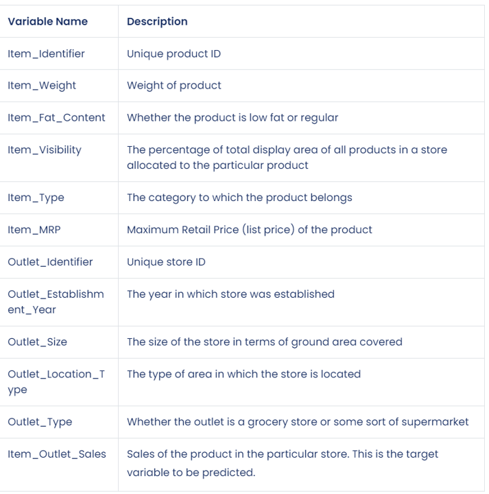

# SALES PREDICTIONS 

**Author**: Milene Carmes Vallejo 

### Business problem:

This project is a sales prediction for food item sold at various stores. The price is in Indian Rupee, the rate is: 1 indian ruppe is about 0.012 USD. 

### Data:
Original data source is from https://datahack.analyticsvidhya.com/contest/practice-problem-big-mart-sales-iii/

Here is the Data Dictionary for this dataset

## Methods
- Data preparation steps with explanation and justification for choices

- 

## Results

### Here are examples of how to embed images from your sub-folder

#### Visual 1 Title

> Sentence about visualization.
#### Visual 2 Title

## Recommendations:

More of your own text here

## Limitations & Next Steps

More of your own text here

### For further information
