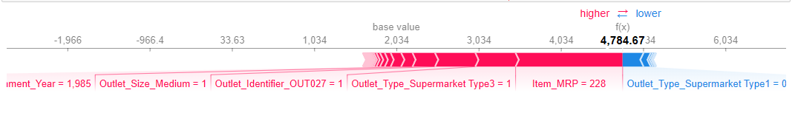
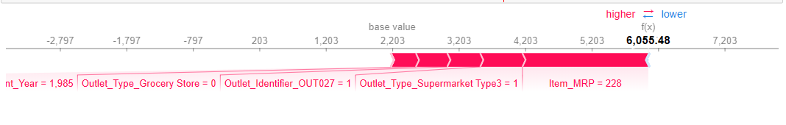
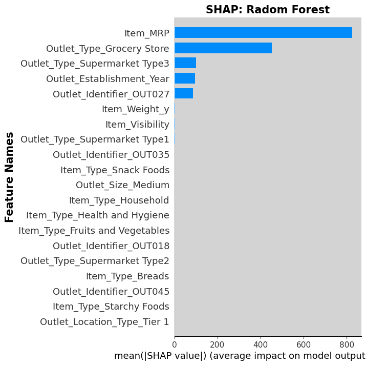
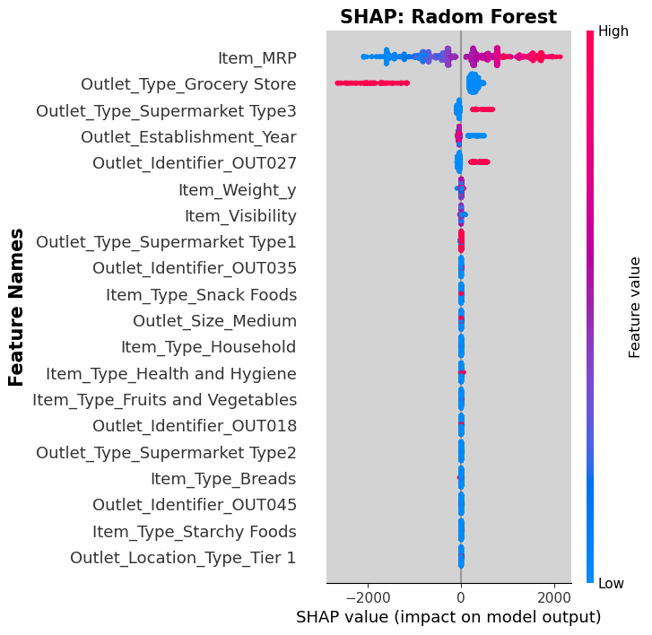
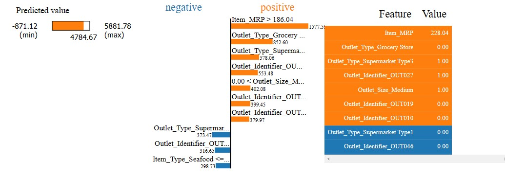
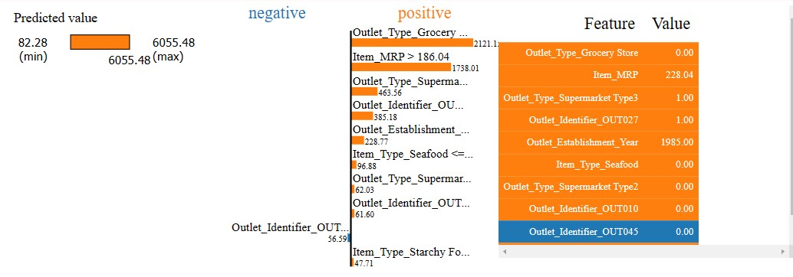
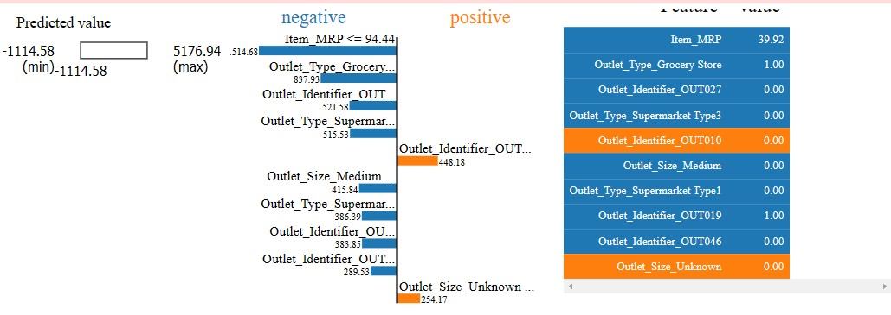
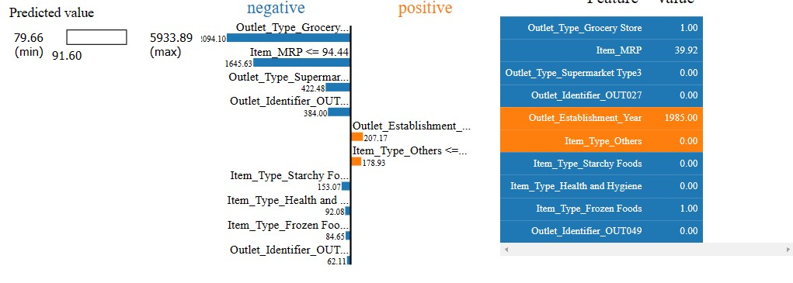

# SALES PREDICTIONS 

**Author**: Milene Carmes Vallejo 

### Business problem:

It is a sales prediction for food sold in various stores.

The goal of this project is to help the retailer better understand which products and what factors influence increasing sales (the price is in Indian Rupee)

### Data:
Original data source is from https://datahack.analyticsvidhya.com/contest/practice-problem-big-mart-sales-iii/

Here is the Data Dictionary for this dataset

## Methods

#### Machine Learning part: 

- Dropping unnecessary columns.
- Data preparation: checked for duplicates, inconsistencies values, and ensured all columns had the correct data types.
- Train/Test split: Set the "Item_Outlet_Sales" column as the target variable.
- Created a selector columns to handle both numerical and categorical columns, as this dataset contains both.
- Checked missing values: Addressed missing values in the numeric column "Item_Weight" (a float) and in the categorical column "Outlet_Size."
- Used OHE for categorical columns. 
- Pipeline creation: Built separate pipelines for numerical and categorical columns using make_pipeline.
- Created tuples for numeric and categorical columns, where the first element was the transformer and the second element was the ColumnSelector object
- Used make_column_transform to combine the numeric and categorical tuples
- Applied 3 Models:  Linear regression, Decision Tree Regressor, and Randon Forest 
- Extracted and and plotted the coefficients determined by Linear Regression.
- Extracted and and plotted the feature importances determined by the Decision Tree Regressor and Random Forest models.
- Evaluated the performance of 3 models based on r^2 and used regression metrics (MAE, MSE, RMSE).
- Compared the performance of the three models.

## Results

#### Which Items generate the greatest amount of sales?

> Fruits, vegetables and snack foods are the top-selling items,  with sales exceeding ₹2,500,00 in sales.

#### Which outlet type has better sales?

Supermarket Type1 has the highest total sales.

#### Does Location affect Sales?

The type of area in which the store is located is linked to better sales. Supermarket Type 1, which has the highest sales, is present in all tiers, with Tier 2 locations outperforming those in Tier 1 and Tier 3 in terms of sales.

#### Does the year in which store was established is related with better sales?

The year in which stores were established does not appear to impact sales. Supermarket Type 1 stores were established between 1987 and 2007, and there is no significant difference in sales performance across these years.

## Coefficients with Linear regression

#### Interpreting Model's Coefficients

#### Coefficients that Positively Influence the predicted sales:
Outlet_Location_Type_Tier 3: Being in the Location_Type_Tier 3 increases the predicted sales by 578.079.

Outlet_Identifier_OUT027: Being the Outlet # OUT027 increases the predicted sales by 578.079.

Outlet_Size_Medium: Being the Outlet of medium size increases the predicted sales by 412.835.

Outlet_Type_Supermarket Type1: Being the Outlet of Supermarket Type1 increases the predicted sales by 343.800.

Item_Type_Seafood: Sell seafood increase the predicted sales by 308.889

#### Coefficients that Negatively Influencethe the predicted sales:

Outlet_Type_Grocery Store: Being a Grocery store subtracted 779.810 from the predicted sales.

Outlet_Identifier_OUT019: Being the Outlet # OUT019 decreases the predicted sales by 452.442.

Item_Visibility: low visibility decrease the predicted sales by 423.390.

Outlet_Identifier_OUT010: Being the Outlet # OUT010 decreases the predicted sales by 327.368.

Outlet_Establishment_Year_1998: if the store was established in 1998 decreases the predicted sales by 327.368

## Features importance with Random forest

#### Interpreting feature importances - Random Forest

Item_MRP (price), Outlet_Type_Grocery Store, Outlet_Identifier_OUT027, Outlet_Type_Supermarket Type3 and Outlet_Establishment_Year_1985 were the most important features used by our model. But we do not know the actual relationship between the feature and the target (Item_Outlest_Sales).

## Local Explanations
## Force Plot - Linear Regression explanation

## Force Plot - Random Forest explanation

### Interpret what features most heavily influenced the predictions

The red features push the prediction to a greater value (higher sales), while the blue features push the prediction to a lower value (lower sales).

We can observe thhat if the outlet is supermarket type 3, was established in 1985 and is OUT027 these features push the prediction to a higher sales.

The prediction with random forest model was higher compared to the prediction from the Linear Regression model.

## Interpreting SHAP - - Random Forest

##### Compare the most important features according to SHAP vs. your original feature importances.

As we can see above, SHAP's importances is similar to the built-in random forest importances. Item_MRP (price), Outlet_Type_Grocery Store, Outlet_Identifier_OUT027, Outlet_Type_Supermarket Type3 and Outlet_Establishment_Year_1985 were the most important features used by our model.

Like feature importance SHAP visualization is not indicating which direction the features push the prediction. Let's create dot plot type that will provide this information..

Item_MRP - if the price is high(red) increase sales, if is low (blue) decrease sales. 

Outlet_Type_Grocery Store - if it is a grocery store decrease sales. 

If the store is the # OUT027 or it is a supermarket Type3  increase sales. 

If it has lower year (blue) that means older outlet increase sales.

## Lime tabular explanation - Linear Regression 

### high sales

## Lime tabular explanation - Random Forest 
### high sales

## Lime tabular explanation - Linear Regression
### low sales

## Lime tabular explanation - Random Forest 
### low sales

### Interpret what features most heavily influenced the predictions, according to LIME.¶
For high sales:

The prediction for higher sales is influenced by several factors. If the outlet is a Supermarket Type 3, was established in 1985, is identified as OUT027, and has a high Item_MRP (price), these features push the prediction towards higher sales in both the Linear Regression and Random Forest models.
In the Linear Regression model, an additional feature—having a medium-sized outlet—also increases sales.

For low sales:

If the outlet is a Grocery Store and has a low Item_MRP, this pushes the sales prediction lower.
In the Linear Regression model, if the outlet is identified as OUT019, this decreases sales.
In the Random Forest model, selling frozen foods also lowers sales predictions.

## Recommendations:

Compare the performance of models based on R2:

With the linear regression model, the R2 score in the training dataset was 56%, with the decision tree and random forest model after tunning were 60%.

These scores can be interpreted as saying that the linear regression model can account for about 56% of the variation in y_test using the features in X_test. The decision tree and random forest model can account for about 60% .

Compare the performance of models based on MSE:

A lower MSE is better as we want to reduce the size of errors, especially large errors!

The mean of the target is 2095.231046 and if we check MSE in all models were:

1 -linear regression was MSE: 1,198,492.82,

2 - decision tree regressor was 1,057.44

3 - random forest: 1,046.96

The MSE was lower with random forest regression but was too far from the mean target and any model had a score higher than 60%. We need to repeat this prediction with more features, the machine needs more data to learn and do a good prediction. Maybe we can improve the score with a more complex model.

## Limitations & Next Steps

We need repeat this prediction with more features, the machine needs more data to learn and do a good prediction. Maybe we can improve the score with more complex model. 

# Tableau Dashboard
https://public.tableau.com/views/sales_project1_16785572220570/Dashboard1?:language=en-US&publish=yes&:display_count=n&:origin=viz_share_link

