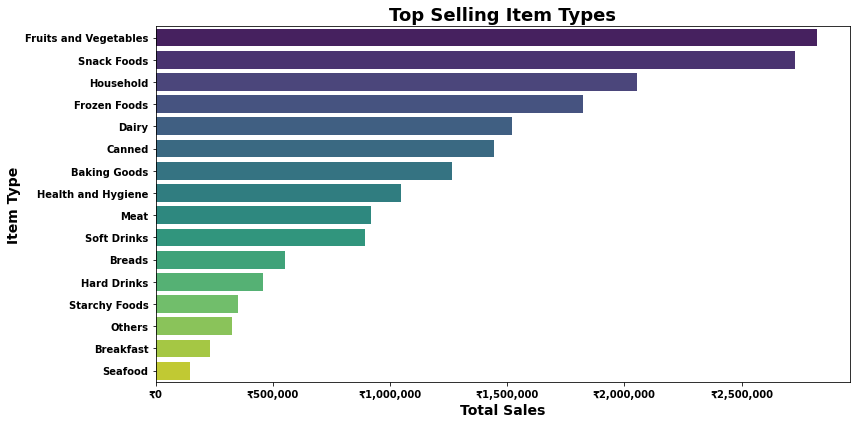
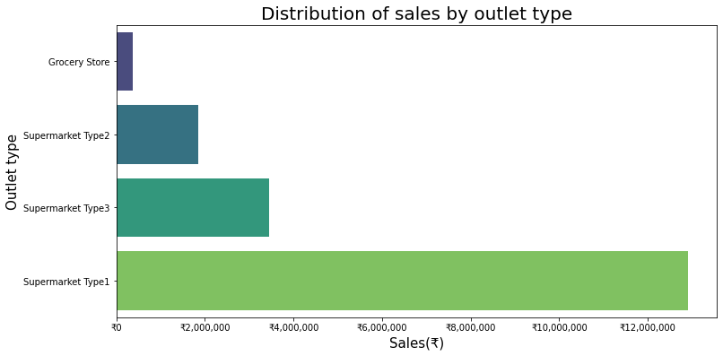
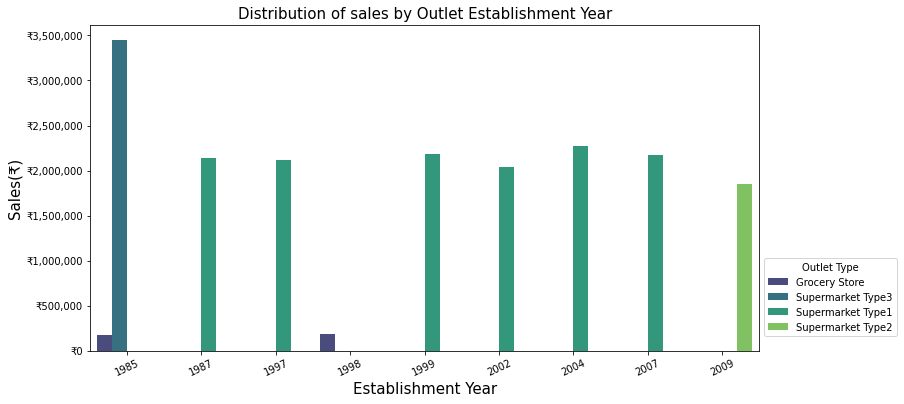

# SALES PREDICTIONS 

**Author**: Milene Carmes Vallejo 

### Business problem:

It is a sales prediction for food sold in various stores.

The goal of this project is to help the retailer better understand which products and what factors influence increasing sales (the price is in Indian Rupee)

### Data:
Original data source is from https://datahack.analyticsvidhya.com/contest/practice-problem-big-mart-sales-iii/

Here is the Data Dictionary for this dataset

## Methods

Predictions part
- Data preparation: check duplicates, fix inconsistencies in Item_Fat_Content column, and check the type of all columns. 
- Train/Test split: "Item_Outlet_Sales" column as the target.
- Make selector columns because there are number and object columns in this dataset.
- Check missing values: There are missing values in the numeric column Item_Weight which is a float number and there are missing values in the categorical column Outlet_Size. I used SimpleImputer the ‘mean’ strategy for numeric columns (that is a float number) and SimpleImputer the ‘most_frequent’ strategy for categorical columns.
- I used OHE for categorical columns and scaler for numeric columns since in machine learning the dataset needs to be all numeric and in the same scale. 
- I made a numeric_pipe and categorical_pipe with make_pipeline. 
- I created tuples for numeric and categorical where the first element is the transformer and the second element is a ColumnSelector object
- I used make_column_transform to put all together (numeric and categorical tuples)
- I used 3 Models:  Linear regression, Decision Tree Regressor, and Randon Forest 
- Evaluated the performance of 3 models based on r^2 and used regression metrics (MAE, MSE, RMSE).
- Compared 3 different models. 

## Results

#### Which Items generate the greatest amount of sales?

> Fruits, vegetables and snack foods are the top selling item with more than ₹2,500,00 in sales.

#### Which outlet type has better sales?

Supermarket Type1 has higher total sales.

#### Does the year in which store was established is related with better sales?

The year in which stores were established is not related to better sales.  We have Supermarket Type 1 established in 1987-2007 and there is no difference in sales.

## Recommendations:

Compare the performance of models based on R2:
With the linear regression model, the R2 score in the training dataset was 56%, with the decision tree and random forest model after tenning were 60%.

These scores can be interpreted as saying that the linear regression model can account for about 56% of the variation in y_test using the features in X_test. The decision tree and random forest model can account for about 60% .

Compare the performance of models based on MSE:
A lower MSE is better as we want to reduce the size of errors, especially large errors!

The mean of the target is 2095.231046 and if we check MSE in all models were:

1 -linear regression was MSE: 1,198,492.82,

2 - decision tree regressor was 1,057.44

3 - random forest: 1,046.96

The MSE was lower with random forest regression but was too far from the mean target and any model had a score higher than 60%. We need to repeat this prediction with more features, the machine needs more data to learn and do a good prediction. Maybe we can improve the score with a more complex model.

## Limitations & Next Steps

We need repeat this prediction with more features, the machine needs more data to learn and do a good prediction. Maybe we can improve the score with more complex model. 

