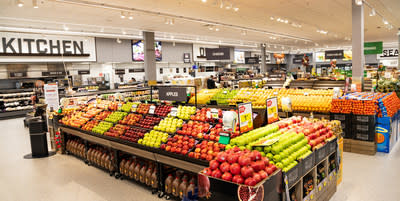
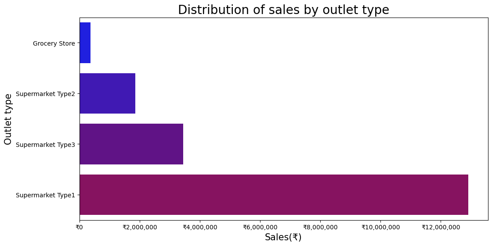
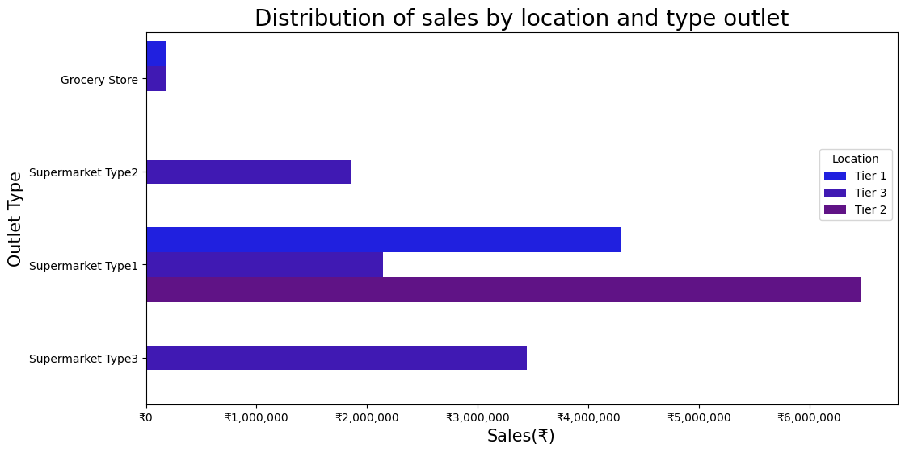
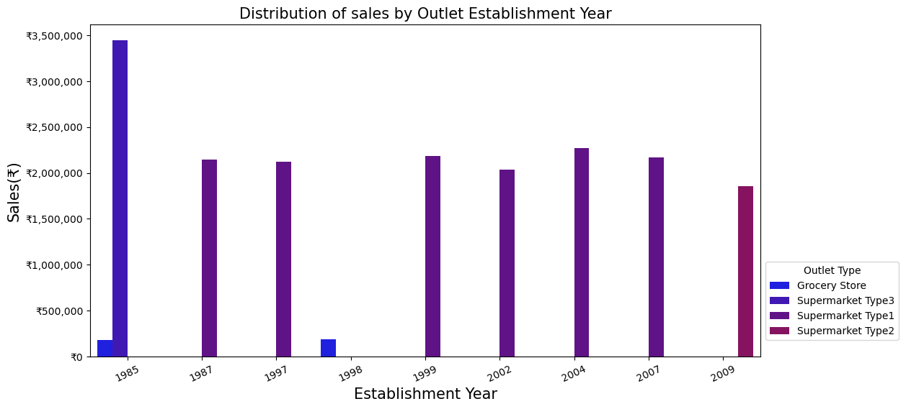
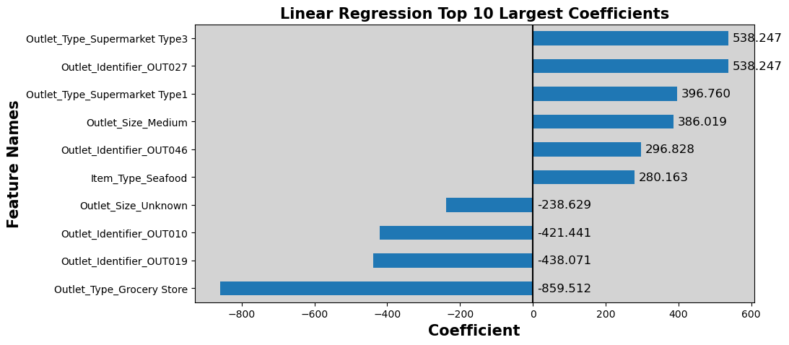
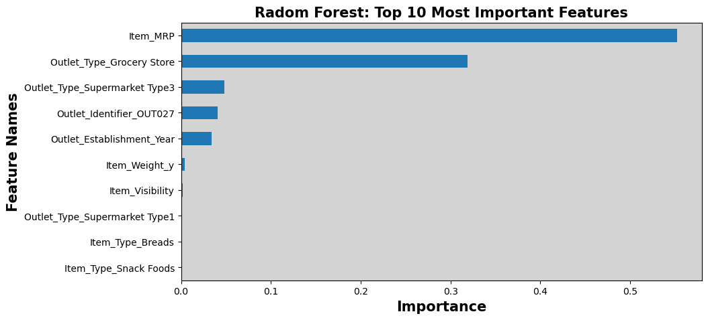
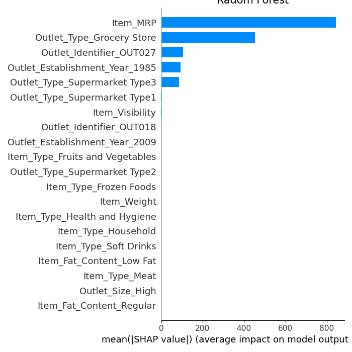
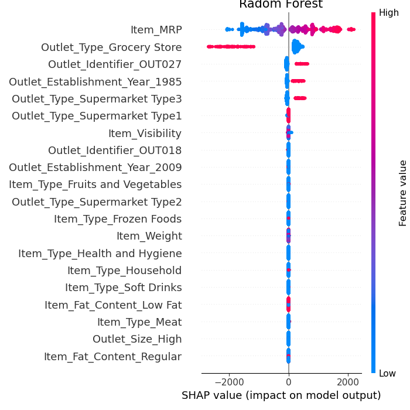

# SALES PREDICTIONS 

**Author**: Milene Carmes Vallejo 

### Business problem:

It is a sales prediction for food sold in various stores.

The goal of this project is to help the retailer better understand which products and what factors influence increasing sales (the price is in Indian Rupee)

### Data:
Original data source is from https://datahack.analyticsvidhya.com/contest/practice-problem-big-mart-sales-iii/

Here is the Data Dictionary for this dataset

## Methods

#### Machine Learning part: 

- Dropping unnecessary columns.
- Data preparation: check duplicates, check inconsistencies values, check the type of all columns. 
- Train/Test split: "Item_Outlet_Sales" column as the target.
- Make selector columns because there are numbers and objects columns in this dataset.
- Check missing values: There are missing values in the numeric column Item_Weight which is a float number and there are missing values in the categorical column Outlet_Size. 
- Used OHE for categorical columns. 
- Made a numeric_pipe and categorical_pipe with make_pipeline. 
- Created tuples for numeric and categorical where the first element is the transformer and the second element is a ColumnSelector object
- Used make_column_transform to put all together (numeric and categorical tuples)
- Used 3 Models:  Linear regression, Decision Tree Regressor, and Randon Forest 
- Extracteand and plot the coefficients that Linear regression determined.
- Extracteand and plot the feature importances that Decision Tree Regressor, and Randon Forest determined. 
- Evaluated the performance of 3 models based on r^2 and used regression metrics (MAE, MSE, RMSE).
- Compared 3 different models. 

## Results

#### Which Items generate the greatest amount of sales?

> Fruits, vegetables and snack foods are the top selling item with more than ₹2,500,00 in sales.

#### Which outlet type has better sales?

Supermarket Type1 has higher total sales.

#### Does Location affect Sales?

The type of the area in which the store is located is related to better sales. Because the Supermarket type 1 which has better sales is located in all tier and at Tier 2 it has higher sales than Tier 1 and Tier 2.

#### Does the year in which store was established is related with better sales?

The year in which stores were established is not related to better sales. During the years 1987 until 2007 were established different Supermarket Type 1 and there is no big difference between them.

### Coefficients with Linear regression

#### Interpreting Model's Coefficients

#### Coefficients that Positively Influence the predicted sales:
Outlet_Location_Type_Tier 3: Being in the Location_Type_Tier 3 increases the predicted sales by 578.079.

Outlet_Identifier_OUT027: Being the Outlet # OUT027 increases the predicted sales by 578.079.

Outlet_Size_Medium: Being the Outlet of medium size increases the predicted sales by 412.835.

Outlet_Type_Supermarket Type1: Being the Outlet of Supermarket Type1 increases the predicted sales by 343.800.

Item_Type_Seafood: Sell seafood increase the predicted sales by 308.889

#### Coefficients that Negatively Influencethe the predicted sales:

Outlet_Type_Grocery Store: Being a Grocery store subtracted 779.810 from the predicted sales.

Outlet_Identifier_OUT019: Being the Outlet # OUT019 decreases the predicted sales by 452.442.

Item_Visibility: low visibility decrease the predicted sales by 423.390.

Outlet_Identifier_OUT010: Being the Outlet # OUT010 decreases the predicted sales by 327.368.

Outlet_Establishment_Year_1998: if the store was established in 1998 decreases the predicted sales by 327.368

### Features importance with Random forest

#### Interpreting feature importances - Random Forest

Item_MRP (price), Outlet_Type_Grocery Store, Outlet_Identifier_OUT027, Outlet_Type_Supermarket Type3 and Outlet_Establishment_Year_1985 were the most important features used by our model. But we do not know the actual relationship between the feature and the target (Item_Outlest_Sales).

#### Interpreting SHAP - - Random Forest

Compare the most important features according to SHAP vs. your original feature importances.
As we can see above, SHAP's importances is similar to the built-in random forest importances. Item_MRP (price), Outlet_Type_Grocery Store, Outlet_Identifier_OUT027, Outlet_Type_Supermarket Type3 and Outlet_Establishment_Year_1985 were the most important features used by our model.

Like feature importance SHAP visualization is not indicating which direction the features push the prediction. Let's create dot plot type that will provide this information.

Item_MRP - if the price is high(red) increase sales, if is low (blue) decrease sales.

Outlet_Type_Grocery Store - if it is a grocery store decrease sales.

If the store is the # OUT027 or it is a supermarket Type3 or if was established in 1985 increase sales.

## Recommendations:

Compare the performance of models based on R2:

With the linear regression model, the R2 score in the training dataset was 56%, with the decision tree and random forest model after tenning were 60%.

These scores can be interpreted as saying that the linear regression model can account for about 56% of the variation in y_test using the features in X_test. The decision tree and random forest model can account for about 60% .

Compare the performance of models based on MSE:

A lower MSE is better as we want to reduce the size of errors, especially large errors!

The mean of the target is 2095.231046 and if we check MSE in all models were:

1 -linear regression was MSE: 1,198,492.82,

2 - decision tree regressor was 1,057.44

3 - random forest: 1,046.96

The MSE was lower with random forest regression but was too far from the mean target and any model had a score higher than 60%. We need to repeat this prediction with more features, the machine needs more data to learn and do a good prediction. Maybe we can improve the score with a more complex model.

## Limitations & Next Steps

We need repeat this prediction with more features, the machine needs more data to learn and do a good prediction. Maybe we can improve the score with more complex model. 

