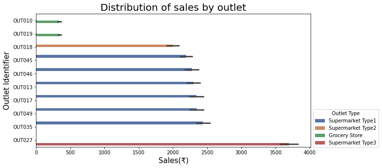

# SALES PREDICTIONS 

**Author**: Milene Carmes Vallejo 

### Business problem:

This project is a sales prediction for food item sold at various stores. The price is in Indian Rupee, the rate is: 1 indian ruppe is about 0.012 USD. 

### Data:
Original data source is from https://datahack.analyticsvidhya.com/contest/practice-problem-big-mart-sales-iii/

Here is the Data Dictionary for this dataset

## Methods

Predictions part
- Data preparation: check duplicates, fix inconsistencies in Item_Fat_Content column, check dtype of all columns. 
- Train/Test split: "Item_Outlet_Sales" column as target.
- Make selector columns because there are numbers and objects columns in this dataset.
- Ckeck missing values: There are missing values in numeric column Item_Weight that is float number and there are missing values in categorical column Outlet_Size. I used SimpleImputer the ‘mean’ strategy for numeric columns (that is a float number) and SimpleImputer the ‘most_frequent’ strategy for categorical columns.
- I used OHE for categorical columns and scaler for numeric columns since in machine learning the dataset needs to be all numeric and in the same scale. 
- I made a numeric_pipe and categorical_pipe with make_pipeline. 
- I created tuples for numeric and categorical where the first element is the transformer and second element is a ColumnSelector oject
- I used make_column_transform to put all together (numeric and categorical tuples)
- I used 3 Models :  linear regression model, Decision Tree Regressor and Randon Forest 
- Evaluated the performance of 3 models based on r^2 and used regression metrics (MAE, MSE, RMSE).
- Compared 3 different models. 

## Results

#### Distribution of sales by outlet

> The outlet OUT027, wich is a supermarket type 3, has better sales than others outlet. Supermarkets type 1 and 2 have similar sales and grocery stores OUT010, OUT019 have lower sales.

## Recommendations:

With linear regression model the R2 score in training dataset was 56%, with decision tree model was 11% and with random forest tunned the score was 60%.

These scores can be interpreted as saying that linear regression model can account for about 56% of the variation in y_test using the features in X_test and random forest model 60%.

The MSE was lower with random forest regression but was too far from the mean target and any model had a score higher than 60%. I don't think these 3 models of  predictions are good in this dataset.

## Limitations & Next Steps

We need repeat this prediction with more features, the machine needs more data to learn and do a good prediction. Maybe we can inprove the score with more cmplex model. 

